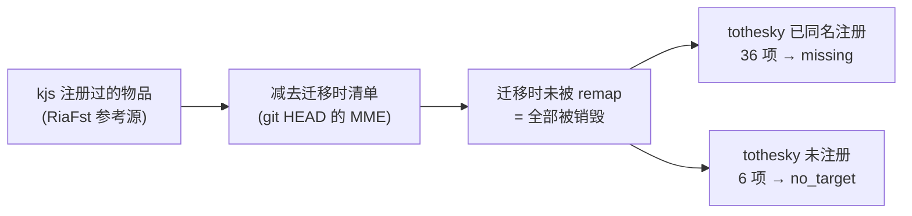

# ToTheSky 存档扫描器

扫描 Minecraft Java 版存档（`.mca` 区域文件 + NBT 数据文件），提取所有**需要迁移的物品**，
输出模组可直接解析的 JSON 清单，供后续修复模组回填。

## 为什么需要它

KubeJS 卸载后，存档中 `kubejs:*` 的物品 id 若没有对应的 remap 映射，会在世界加载时
被 Forge 判定为缺失条目（`MissingMappingsEvent` 的 `DEFAULT` 分支），而物品注册表
**没有** `MissingFactory` 占位实现，于是该物品栈被读成空气、下次存档即被字节级抹除。

事后无法从新存档恢复——必须回到**迁移之前的备份**里把数据捞出来。

## 快速开始

```bash
# 闸门检查：备份里到底还有没有 kubejs 物品（10GB 约 1~2 分钟）
python scan_save.py --save /path/to/backup --gate

# 完整提取：输出 restore manifest
python scan_save.py --save /path/to/backup --out restore.json

# 只输出需要补偿的条目，并用现世界的别名表排除已幸存项
python scan_save.py --save /path/to/backup --target-world /path/to/live \
    --out restore.json --missing-only --pretty

# 服务器上重定向到日志（进度按 15s 写行，不刷屏）
python scan_save.py --save /path/to/backup --out restore.json >> scan.log 2>&1
```

## 文件

| 文件 | 作用 |
|---|---|
| `scan_save.py` | 扫描器本体，零依赖 |
| `migration-baseline.json` | **冻结的迁移基线**：迁移时清单 + 被销毁物品表（36 有替代品 / 6 无替代品）。判定依据，不随源码演进 |
| `gen_baseline.py` | 重建基线的脚本（需 git + RiaFst 参考源）；日常扫描不需要 |
| `README.md` | 本文件 |

## 输出契约（formatVersion 1）

```jsonc
{
  "formatVersion": 1,
  "generator": "tothesky-save-scanner/<version>",
  "generatedAt": "2026-09-22T18:50:00Z",
  "source": {
    "save": "…", "regions": 8, "chunks": 2703,
    "baseline": "…/migration-baseline.json",
    "survivedAliases": 0
  },
  "summary": {
    "entries": 12,
    "needsCompensation": 12,
    "hasTarget": 12,
    "noTarget": 0,
    "alreadyRemapped": 0,
    "byItem": { "kubejs:delta_coin": 12 },
    "byContainer": { "backpack_item": 4, "block_entity": 4, "player_inventory": 1 }
  },
  "entries": [
    {
      "status": "missing",              // missing/no_target = 需补偿；already_remapped = 跳过
      "remapTo": "tothesky:delta_coin", // 有替代品时的目标 id；no_target 时为 null
      "origin": {
        "type": "block_entity",          // 见下表
        "dimension": "minecraft:overworld",
        "pos": [-4, -60, -8],
        "blockEntity": "minecraft:chest",
        "player": null,                  // 玩家来源时 {"uuid": "...", "name": "..."}
        "label": null                    // curios 槽位名 / 被引用物品 id 等
      },
      "path": "block_entities[0].Items[0]",  // 在 NBT 中的精确位置，便于审计
      "slot": 0,
      "chain": [                            // 外层容器链：从最外层到该物品
        { "type": "block_entity", "pos": [-4, -60, -8], "blockEntity": "minecraft:chest" }
      ],
      "item": {
        "id": "kubejs:delta_coin",
        "count": 64,
        "snbt": '{Slot:0b,id:"kubejs:delta_coin",Count:64b}'
      }
    }
  ]
}
```

### `item.snbt`

**权威字段**。完整 ItemStack 的 SNBT 文本，类型无损（`64b` / `1L` / `1.0f` 区分保留）。
模组侧直接 `ItemStack.of(TagParser.parseTag(entry.item.snbt))` 即可还原，无需自写 NBT 解析。

### `origin.type` 取值

| type | 含义 | 回填方式 |
|---|---|---|
| `player_inventory` | 玩家主物品栏 | 按 `slot` 放回 `player.getInventory()` |
| `player_ender` | 末影箱 | `player.getEnderChestInventory()` |
| `curios` | 饰品栏 | Curios API `addSlotModifier`/按 `label` 定位 |
| `block_entity` | 世界方块容器（箱子/桶/木桶/潜影盒/布袋/抽屉/…） | 按 `pos` 找方块实体，`Container.setItem` |
| `placed_item` | Plonk 放置在地上的物品（`plonk:placed_items`） | 按 `pos`，容器即该方块实体 |
| `backpack_block` | 精妙背包（放置态），内容在全局文件 | 按 `pos` 的方块实体，`contentsUuid` 关联 |
| `backpack_item` | 精妙背包（物品态，在背包/饰品栏/容器里） | 放回该物品，`contentsUuid` 关联全局文件 |
| `ae2_cell` | AE2 存储元件内物品（元件可在驱动器/背包/箱子中） | 需按元件 `keys`/`amts` 写回元件 NBT |
| `ae2_drive` | AE2 ME 驱动器的元件槽 | 按 `pos` 的 `inv.itemN` |
| `entity_container` | 实体容器（箱船/箱矿车/驴背包） | 按实体 UUID |
| `entity_item` | 展示框/掉落物持有的单个物品 | 按实体 UUID，`.Item` |
| `backpack_storage_file` | 精妙背包全局文件（`data/sophisticatedbackpacks.dat`） | 与 `backpack_item` 配对，不单独回填 |

`chain` 记录外层容器链，用于处理"背包里有潜影盒、潜影盒里有物品"这类嵌套：回填时先确保
最外层存在，再逐层进入。

## 覆盖的存储位置

| 位置 | 路径 | 格式 |
|---|---|---|
| 玩家物品栏 | `playerdata/<uuid>.dat` → `Inventory` | 槽位 0-35 主栏 / 100-103 装备 / -106 副手 |
| 玩家末影箱 | `playerdata/<uuid>.dat` → `EnderItems` | 同上 |
| 玩家饰品栏 | `ForgeCaps."curios:inventory".Curios[]` | `StacksHandler.Stacks.Items` |
| 世界方块容器 | `region/*.mca` → `block_entities[]` | `Items[]` 或 `inv.itemN` |
| Plonk 放置物品 | `plonk:placed_items` | `Items[]` + `ItemRotation`/`RenderType` |
| 精妙背包（放置） | `sophisticatedbackpacks:backpack` | `backpackData` 物品 + `contentsUuid` |
| 精妙背包（物品） | 任意 ItemStack | `tag.contentsUuid` |
| 精妙背包（全局） | `data/sophisticatedbackpacks.dat` | `data.backpackContents[]` |
| AE2 元件 | 元件物品 `tag.keys`/`amts`/`ic` | 键数组 + 数量数组 |
| AE2 驱动器 | `ae2:drive` → `inv.item0..9` | 元件物品槽 |
| 潜影盒（物品） | ItemStack `tag.BlockEntityTag.Items` | 递归 |
| 实体容器 | `entities/*.mca` → `Entities[]` | `Items[]` |
| 展示框 / 掉落物 | `entities/*.mca` → `Entities[]` | `.Item` |

维度识别：`region/` `entities/` → 主世界；`DIM-1/` → 下界；`DIM1/` → 末地；
`dimensions/<ns>/<path>/` → `<ns>:<path>`。

## 进度条

默认开启，写在 **stderr**，因此 stdout 只剩结果行，便于脚本管道消费。

```
扫描世界 [████████████░░░░░░░░░░░░░░]  46.2%  32/71  区块 12480  命中 9  3.2 文件/s  剩余 12s
```

- **TTY**：单行 `\r` 刷新（100 ms 节流），方块条。
- **输出重定向**（服务器日志、管道）：按 15 s 间隔输出整行，ASCII 条 `[####----]`，
  避免刷屏；代码页不支持方块字符时自动退回 ASCII。
- 关掉：`--no-progress`。

进度以**区域文件**为单位——区块总数要解压后才知道，而区域文件数可预知，且它就是耗时主因。

## 判定"是否需要补偿"

判据是 **`migration-baseline.json`** —— 一张冻结的历史事实表，**不是当前源码清单**。

### 为什么不能用当前清单

把事后补进 `MIGRATED_ITEMS` 的条目当作"已妥善处理"，会把**全部损失漏报成无需补偿**。
事后补 remap 只能防未来的损失，救不回已经销毁的物品——这正是"亡羊补牢"。



基线即上图的产物，由 `git HEAD` 的清单与 RiaFst 参考源的注册名做集合差得到，
**冻结、不随源码演进**。生成方法与初期分析完全一致。

### 判定优先级

| 顺序 | 条件 | 结论 |
|---|---|---|
| 1 | 存档别名表有 `kubejs:X -> tothesky:X` | `already_remapped`（remap 确实执行过） |
| 2 | X 在**迁移时清单**内 | `already_remapped`（当时 remap 生效） |
| 3 | X 在 `destroyed.withTarget` 内 | `missing`（被销毁，但现有同名替代品） |
| 4 | X 在 `destroyed.withoutTarget` 内 | `no_target`（被销毁，无替代品） |
| 5 | X 在当前源码清单内 | `missing`（基线之外的兜底） |
| 6 | 其余 | `unknown`（留待人工确认） |

### `status` 取值

| status | 含义 | 模组应如何处理 |
|---|---|---|
| `missing` | 迁移时被销毁，有同名替代品 | **需要补偿**，目标 `remapTo`（如 `tothesky:delta_coin`） |
| `no_target` | 迁移时被销毁，无替代品 | **需要补偿**，但需人工定夺（如 `hemostix`） |
| `already_remapped` | 迁移时已被 remap 接住 | 跳过 |
| `unknown` | 基线未收录 | 人工确认后再决定 |
| `missing_content` | 背包物品在，但 `contentsUuid` 查无内容 | 记录待人工核对 |
| `note_empty` | 容器类实体存在但未发现物品字段 | 诊断信息 |

`--missing-only` 保留 `missing` 与 `no_target`，即"全部需要补偿的条目"。

### `--target-world`

传入**迁移后的现世界存档**时，其别名表会并入最高优先级判据。用途：备份与现世界都提供时，
凡现世界别名表已记录的旧名一律不重复补偿——避免同一件物品被补两次。

```bash
# 用现世界的别名表排除已幸存项
python scan_save.py --save <备份> --target-world <现世界> --out restore.json --missing-only
```

### `--remap-source`

指向当前 `MissingMappingEvents.java`，**仅作基线之外的兜底**（优先级 5）。
判据本身不依赖它，因此它指向补过或没补过的版本，都不会改变历史损失的认定。

## 用模组执行回填

扫描器产出的 `restore.json` 由本模组的 `/tothesky restore` 消费。把文件放到
**`config/tothesky/restore.json`**（与 `config/tothesky/letters` 同级），然后：

```
/tothesky restore status    # 看清单条数与台账规模，不动数据
/tothesky restore dry       # 演练：只报告会做什么
/tothesky restore           # 真正执行
```

权限等级 3（高于 `/reload`）——补偿会往世界与玩家手里发实物，属一次性运维动作。

### 投递规则

| 条目来源 | 处理 |
|---|---|
| 玩家物品栏 / 末影箱 / 饰品栏 | 先直接进该玩家背包；**放不下**才整份改走往来包裹（Contact 原生链路，离线也送达） |
| 世界方块容器（箱子/桶/潜影盒/布袋/抽屉/Plonk 放置物/精妙背包方块…） | 先试原槽位，再试任意空位；**装不下或方块已被拆**就在 26 格内找空气放一个新箱子继续装；再不行则报失败 |
| 实体容器（箱船/箱矿车/展示框/驴背包） | 按 UUID 找实体写入；满了同样就近放箱子 |
| AE2 存储元件 | 用 AE2 官方存储 API（`StorageCells.getCellInventory` → `MEStorage.insert` → `persist`）：先把元件从驱动器取出，写入后放回以触发重新挂载 |

同一坐标的容器若**只实现原版 `Container`、没注册 Forge `IItemHandler`**（例如 Plonk 的
`plonk:placed_items` 是 `WorldlyContainer`），会经 `InvWrapper` 包装后写入——
否则会被误判成「无容器能力」而改去旁边放新箱子，物品虽未丢、却回不到原方块里。

玩家投递刻意**不做「进一部分、寄一部分」的拆分**：万一邮寄失败（Contact 未装、昵称非法），
条目会算失败而台账不记，重跑就会把已进背包的那一半再加一次。所以放不下时把试放的部分
**原样退回**，整份交给邮寄——失败时净变化为零，可安全重跑。

### 依赖与客户端

补偿功能用到 **AE2** 与 **Contact** 两个模组的 API，二者都是 `mandatory=false` 软依赖，
引用分别隔离在 `restore/Ae2CellBridge` 与 `contact/ContactMailBridge` 里——
未安装时对应功能降级跳过，模组其余部分照常工作。

**加这两个依赖不需要客户端更新**：

| 改动 | 影响面 | 客户端 |
|---|---|---|
| `build.gradle` 的 `compileOnly` | 仅编译期 | 无关 |
| `build.gradle` 的 `runtimeOnly` | 仅开发运行期（`runClient`） | 无关 |
| `mods.toml` 声明软依赖 | 仅启动期校验/加载顺序 | AE2、Contact 客户端**本来就有** |
| JarJar 内嵌 | 会改变 jar 体积与内容 | 需更新（**未采用**） |

实测产出 jar 内 `appeng/` 条目为 0——依赖没有被打包进去。
唯一需要客户端更新的是新增注册项（网络包／物品／方块／GUI），而本功能一个都没有。

### 执行模型（跨 tick）

补偿**不会把服务器卡在一个 tick 里**。条目按「时间预算 5 ms + 条数上限 64」切片，
每 tick 只做一小段就立刻把 tick 还给服务器——清单上千条时服务器照常运行。

| 场景 | 行为 |
|---|---|
| 小清单（几十条内） | 启动时立即跑完，命令当场给出摘要 |
| 大清单 | 立即返回，后台跨 tick 推进；进度在 bossbar，完成时给触发者发消息 |
| 触发者中途离线 | 完成消息只写日志（`触发者 X 已离线，结果仅写入日志`） |
| 服务器中途停止 | 任务丢弃并告警中断位置；已完成条目已在台账，重跑续上 |
| 已有任务在跑 | 命令拒绝并发启动，提示看 bossbar |
| 单条处理抛异常 | 只把该条记为失败，任务继续（否则任务会卡死、之后再也启动不了补偿） |

预算里**每条之前都不检查时间**，保证每 tick 至少推进一条——否则遇到单条特别慢
（大区块加载）时会永远卡在原地。

### 未加载区块与离线玩家

| 情况 | 处理 |
|---|---|
| 区块未加载 | `level.getChunk(...)` **同步阻塞加载**后再写入（这正是必须跨 tick 的原因）；加载失败会抛异常，已兜住并记为 `NO_CONTAINER`，不中断任务。加载不追加常驻 ticket，区块随后正常卸载 |
| 玩家不在线 | 走往来包裹（`ContactMail.sendParcel`）——Contact 会把信留在队列里，等该玩家上线且邮箱有空位时送达 |
| 玩家在线但背包满 | 退回试放的部分，整份改寄包裹（避免「一半进背包」在重跑时被重复发放） |
| AE2 驱动器区块未加载 | 同上，先加载区块再取元件 |

### 幂等

每条成功补偿的指纹记在 `tothesky_restore_ledger`（主世界 SavedData）。重跑命令会跳过已完成的条目，
因此**连点两次不会发双份**；失败条目可修正清单后重跑补齐（已成功的不会重复发放）。

### 纯服务端

回填不注册任何网络包、物品、方块或 GUI，进度用原版 `ServerBossEvent` 显示——
**客户端不需要更新**。

## 依赖

- Python 3.9+，**无第三方依赖**（NBT 解析器与 SNBT 序列化器均为内置实现）。

## 验证情况

测试存档：**迁移前快照**（2703 区块 / 13 MB，别名表为空），内含目标物品 `kubejs:delta_coin` 12 处。

- **判定正确**：12 处全部报为 `missing`，`remapTo: tothesky:delta_coin`。
  `delta_coin` 正是会话初期查出的 36 项之一——事后把它补进 `MIGRATED_ITEMS` 属亡羊补牢，
  基线判据仍正确认定它需要补偿。
- **基线表自洽**：
  - `destroyed.withTarget` 36 项 → 全部 `missing` ✓
  - `destroyed.withoutTarget` 6 项 → 全部 `no_target` ✓
  - 迁移时清单 101 项 → 误报 `missing` 的为 **0** ✓
  - 与初期分析得出的 36 项表**逐字一致**（差集为空）✓
- **完整性**：按"任意路径下的 kubejs 物品栈 + AE2 键"暴力枚举得 12 个，扫描器产出 12 条，**差异 0**。
- **序列化正确性**：存档内全部 35 个物品栈做 SNBT 往返，用独立的 SNBT 解析器
  （`amulet-nbt`）读回并逐字段比对，**35/35 通过**——即模组侧
  `ItemStack.of(TagParser.parseTag(snbt))` 可无损还原。
- **判定优先级**：以迁移后世界（109 条别名）作 `--target-world` 交叉验证——
  `ramen` / `cooked_dumpling`（迁移时清单内）→ `already_remapped`；
  `delta_coin` / `cheese` / `squid_festival` → `missing`；
  `hemostix` / `event_item_1`（无替代品）→ `no_target`。
